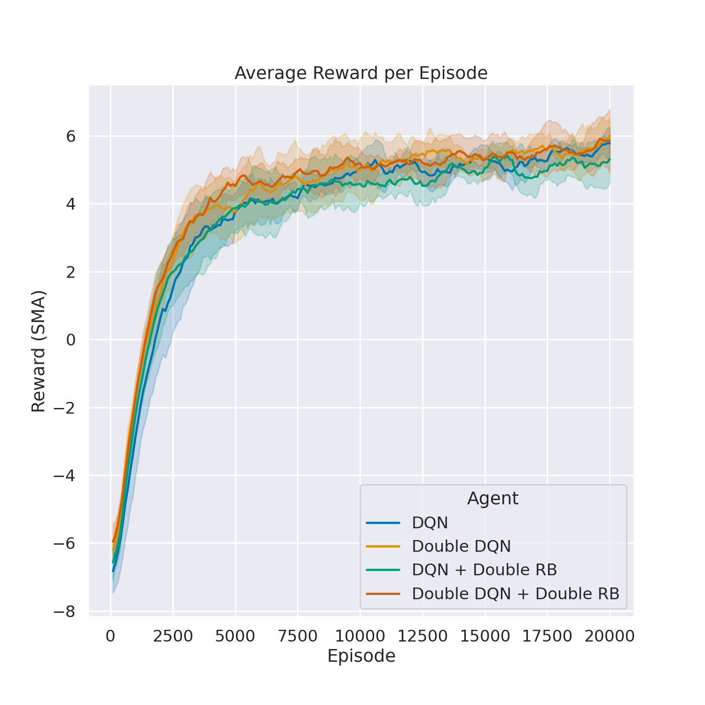
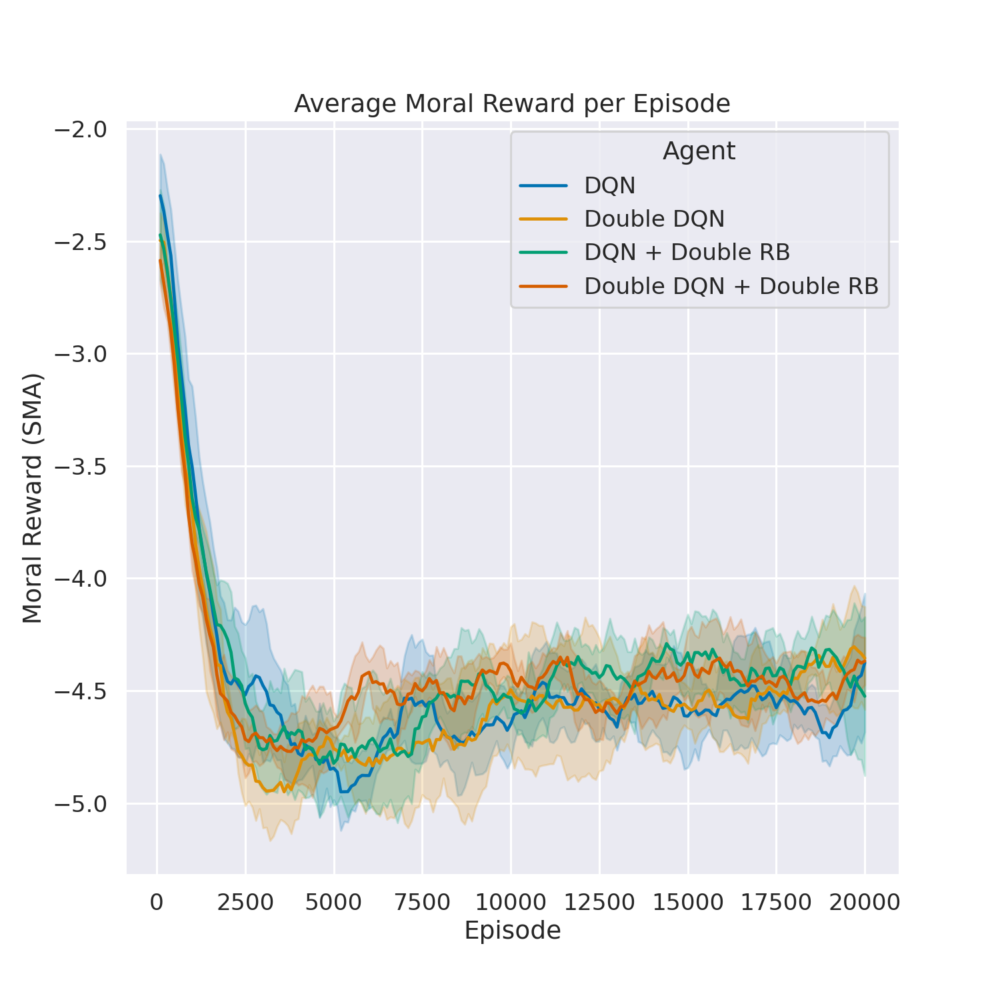
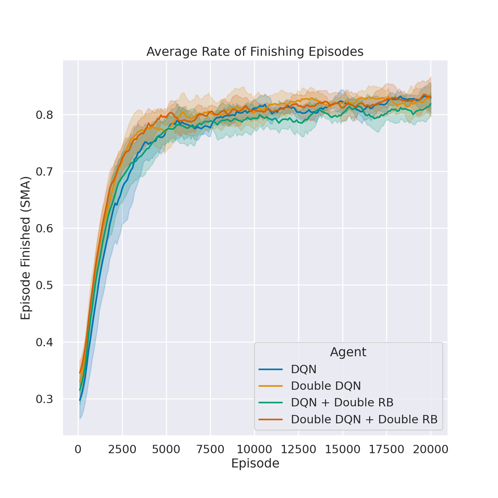
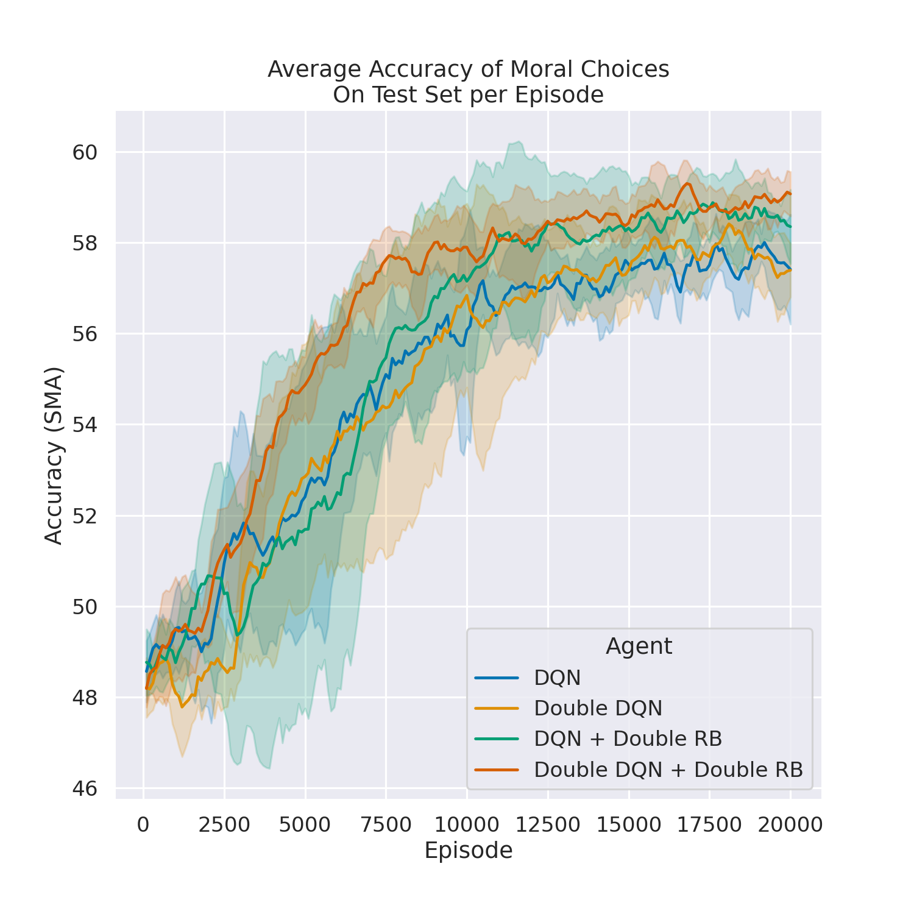

# Moral Self-Driving Agents: Investigating Reinforcement Learning for Moral Decision Problems in Autonomous Vehicles

An NUS CS4246/CS5446 AI Planning and Decision Making project.

* **Kingsley Kuan** - [kingsleykuan](https://github.com/kingsleykuan)
* **Joel Ho** - [JoelHo](https://github.com/JoelHo)
* **Zechariah Tan** - [ZechariahTan](https://github.com/ZechariahTan)

## Setup
Environment can be setup using Conda:
```
conda env create -f environment.yml
conda activate moral-agent
```

Note: All scripts should be executed from `src/` directory

## Moral Machine Dataset
Dataset is available at: https://osf.io/3hvt2/?view_only=4bb49492edee4a8eb1758552a362a2cf

Extract `Moral Machine/Datasets/Moral Machine Data/SharedResponses.csv.tar.gz` into `src/data/SharedResponses.csv`

## Moral Reward Model
Extract data from Moral Machine Dataset
```
python -m moral_rewards.scripts.extract_moral_data \
--input_data_path 'data/SharedResponses.csv' \
--output_data_path 'data/moral_data.csv' \
--chunksize 100000
```

Convert data from extracted Moral Machine Dataset
```
python -m moral_rewards.scripts.convert_moral_data \
--input_data_path 'data/moral_data.csv' \
--data_path_train 'data/moral_data_train.npz' \
--data_path_val 'data/moral_data_val.npz' \
--data_path_test 'data/moral_data_test.npz' \
--train_size 0.8 \
--val_size 0.1 \
--random_seed 0
```

Train neural network to approximate reward function based on preferences from Moral Machine Dataset
```
python -m moral_rewards.train_moral_reward_model
```

## Moral DQN Agent
Train moral DQN agent
```
python -m learning_network.train_dqn
```

Evaluate moral DQN agent
```
python -m learning_network.evaluate_moral_dqn
```

## Interactive Simulator

Interactive simulator can be run with `InteractiveNotebook.ipynb`

Pre-trained models are available in `src/models/`

## Plotting Results
Results can be plotted with `plot_results.ipynb`









